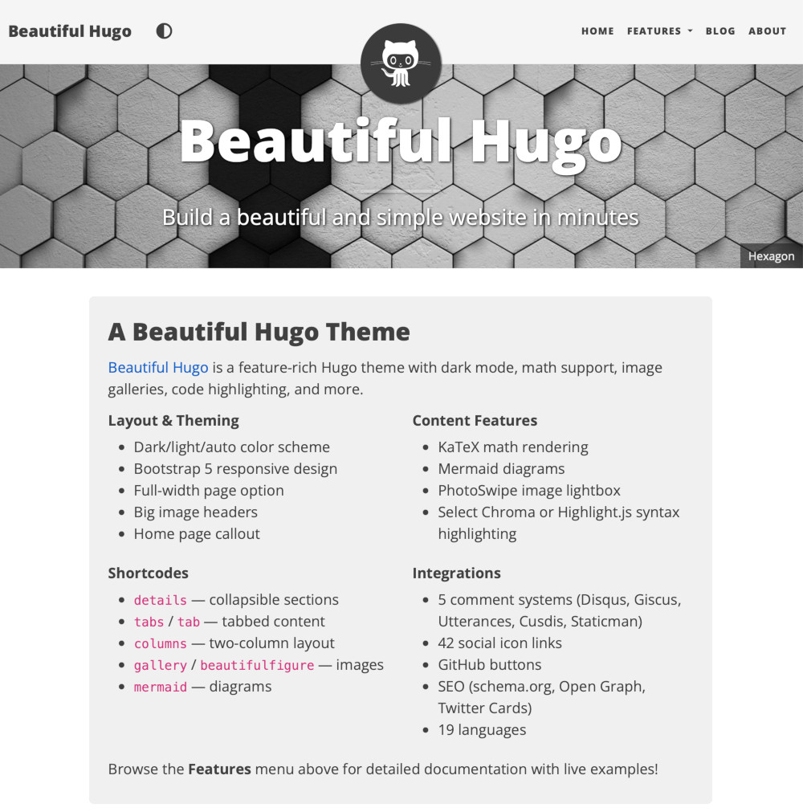

# Beautiful Hugo

An adaptation of the [Beautiful Jekyll](https://deanattali.com/beautiful-jekyll/) theme by [Dean Attali](https://deanattali.com/aboutme#contact), with years of community updates and many new features.

<picture>
  <source media="(prefers-color-scheme: dark)" srcset="images/screenshot-dark.jpg">
  
</picture>

## Live demo

- **Current:** <https://halogenica.net/beautifulhugo>
- **Legacy:** <https://hugo-theme-beautifulhugo.netlify.app>

The example site includes detailed feature pages with live examples — see [Features](#features) below.

## Installation

Install Hugo and create a new site. See [the Hugo documentation](https://gohugo.io/getting-started/quick-start/) for details.

### Git Submodule

```sh
git submodule add https://github.com/halogenica/beautifulhugo.git themes/beautifulhugo
```

### Hugo Module

```sh
hugo mod init github.com/USERNAME/SITENAME
hugo mod get github.com/halogenica/beautifulhugo
```

Stay up to date with `hugo mod get`.

If using Hugo modules, add this to your `hugo.toml`:

```toml
[[module.imports]]
  path = "github.com/halogenica/beautifulhugo"
```

### Preview

Copy the example site content and start Hugo:

```sh
cp -riv themes/beautifulhugo/exampleSite/* .
hugo serve
```

## Features

| Feature | Details |
|---------|---------|
| **Responsive design** | Looks great on desktop and mobile |
| **Light/dark/auto color scheme** | Navbar toggle with `localStorage` persistence |
| **Syntax highlighting** | Chroma (server-side, default) or Highlight.js (client-side) |
| **KaTeX math** | Inline `//(...//)` and display `$$...$$` — no config needed |
| **Mermaid diagrams** | Flowcharts, sequence diagrams, Gantt charts via shortcode |
| **PhotoSwipe galleries** | `beautifulfigure` and `gallery` shortcodes with lightbox |
| **Shortcodes** | `details`, `columns`/`column`, `tabs`/`tab`, `mermaid`, `gallery`, `beautifulfigure` |
| **Markdown extensions** | Callout boxes (note/warning/error/success), theme-dependent content, utility classes |
| **Comment systems** | Disqus, Giscus, Utterances, Cusdis, Staticman |
| **SEO** | Schema.org JSON-LD, Open Graph, Twitter Cards — automatic |
| **Multilingual** | 19 languages with navbar language switcher |
| **Social icons** | 42 platforms in the footer via `[Params.author]` |
| **Self-hosted assets** | `selfHosted = true` for GDPR/EU-DSGVO compliance |
| **Big image headers** | Full-width hero images with fade cycling |
| **Social sharing** | Share buttons on posts (Twitter, Facebook, Reddit, LinkedIn, etc.) |
| **GitHub buttons** | Star/watch/fork badges via front matter |
| **Google Analytics** | Standard Hugo integration (production only) |
| **Integrated search** | Fast client-side search with Fuse.js |
| **RSS** | Built-in, enabled with `rss = true` |

For complete configuration reference, shortcode documentation, and live examples, see the [example site feature pages](https://halogenica.net/beautifulhugo/page/configuration/):

- [Configuration](https://halogenica.net/beautifulhugo/page/configuration/) — every `hugo.toml` parameter
- [Shortcodes](https://halogenica.net/beautifulhugo/page/shortcodes/) — `details`, `columns`, `tabs`, `gallery`, `mermaid`
- [Code Blocks](https://halogenica.net/beautifulhugo/page/code-blocks/) — Chroma vs Highlight.js, line numbers, copy button
- [Markdown Extensions](https://halogenica.net/beautifulhugo/page/markdown-extensions/) — callout boxes, theme-dependent content
- [Figures & Galleries](https://halogenica.net/beautifulhugo/page/figures-and-galleries/) — PhotoSwipe integration
- [Math & Diagrams](https://halogenica.net/beautifulhugo/page/math-and-diagrams/) — KaTeX and Mermaid examples
- [Layout Options](https://halogenica.net/beautifulhugo/page/pages-and-layouts/#layout-options) — big images, full-width, hidden pages (part of Pages & Layouts)
- [Comments & Social](https://halogenica.net/beautifulhugo/page/comments-and-social/) — comment systems, social sharing, footer icons
- [SEO & i18n](https://halogenica.net/beautifulhugo/page/seo-and-i18n/) — structured data, Open Graph, multilingual

## Quick Start Config

```toml
baseurl = "https://example.com/"
title = "My Site"

[Params]
  subtitle = "Build a beautiful and simple website in minutes"
  mainSections = ["post", "posts"]
  logo = "/img/avatar-icon.png"
  favicon = "/img/favicon.ico"
  dateFormat = "January 2, 2006"
  colorScheme = "auto"
  readingTime = true
  socialShare = true
  showRelatedPosts = true
  rss = true

  [Params.search]
    provider = "fuse"

[Params.author]
  name = "Your Name"
  website = "yourwebsite.com"
  email = "youremail@domain.com"
  github = "username"

[markup.highlight]
  noClasses = false

[markup.goldmark.parser.attribute]
  block = true

[markup.goldmark.renderer]
  unsafe = true
```

> **Note:** `[Params.author]` is required. The old top-level `[author]` key is deprecated and will produce a build error.

## License

MIT Licensed, see [LICENSE](https://github.com/halogenica/Hugo-BeautifulHugo/blob/master/LICENSE).
